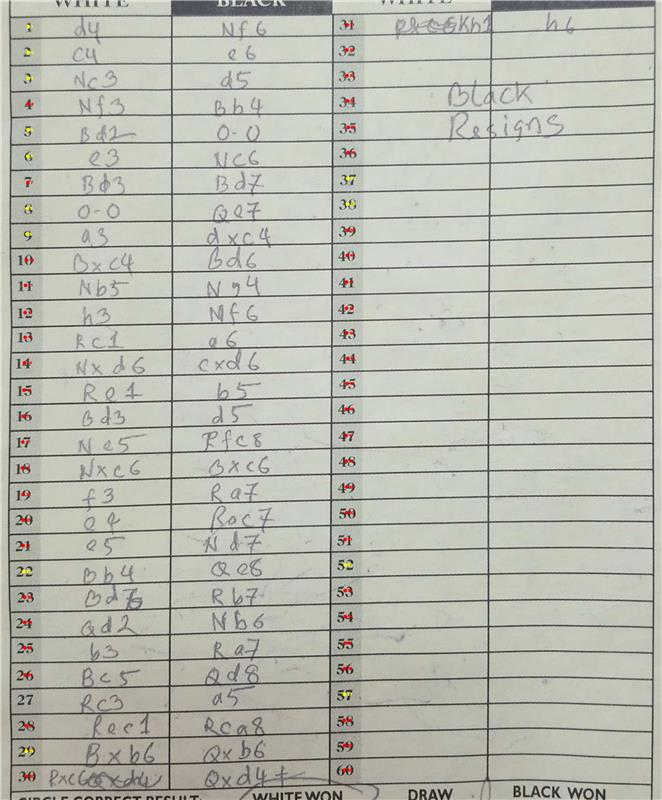
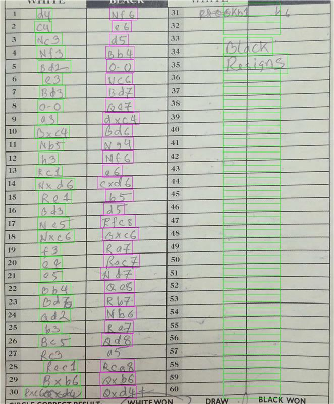
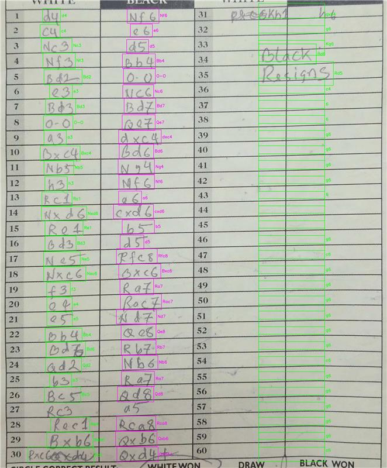

There are two parts to this project:
1. **chess_ocr directory**: contains the OCR code for parsing the scoresheet images.
2. **Other directories**: correspond to the website code.

## Scoresheet OCR
There are two files in `chess_ocr` directory:
1. `scoresheet_pipeline.py`: This contains the steps needed to process an image of a scoresheet.
2. `server.py`: This contains the flask server to process requests that come with the scoresheet image.

### Methodology
The pipeline uses a 6 step process to process the image:

1. **Step 1: Cell Detection**
   Train a YOLO model to detect number and move cells. PaddleOCR is used to extract numbers and detect handwritten text to generate the initial boxes.  
   

2. **Step 2: Deskewing**
   Change the orientation of the scoresheet image. Since users may take pictures at tilted angles, the slope of the YOLO boxes is used to deskew the image.For this specific scoresheet, it was already quite vertically aligned. So its pretty much like it was originally.   
   

3. **Step 3: Number Anchors**
   Generate number anchors. The goal is to use the detected numbers as anchors to determine the location of move cells. Note how some numbers are missing since YOLO doesn't find all number cells.  
   

4. **Step 4: Extrapolation**
   Extrapolate number cells that were not already found by YOLO. Using heuristics based on the fact that numbers must be monotonically increasing, missing number cells are filled in. In the image below, the extrapolated numbers are shown in yellow.  
   

5. **Step 5: Association**
   Associate move cells with number cells. This uses heuristics around histogram binning and constraints (e.g., each move number must have a single white and black move) to map boxes to their specific move number. The green boxes correspond to white moves and the pink boxes to black moves. It also tries to extrapolate move cells that might not have been associated with a number cell.  
   

6.  **Step 6: OCR Detection**
   The open-source PaddleOCR model is finetuned on the HCS dataset to recognize the moves within the cells. A beam search is run to look at the different options and remove ones that are not valid moves based on the python-chess library. The OCR results can be seen in the image.  
   

## Website
There are three directories that contain code and utilities for the website. The website is built on top of the Drogon C++ framework.
1. `controllers`: This directory contains the controllers, the C++ classes, that handle the HTTP requests.
2. `views`: This directory contains the layout csp files that show how a page would look like.
3. `tools`: This contains the scrapy config for crawlers and also the C++ files to copy the crawled content to the backend RocksDB key value pair.
